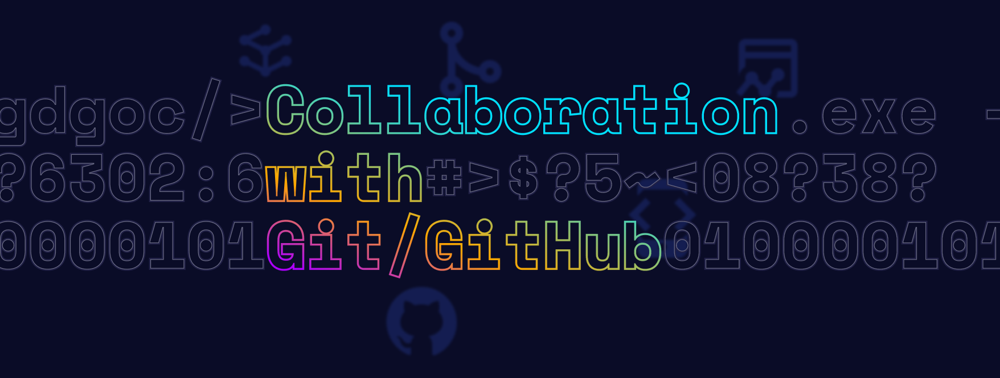

# Collaboration with Git/GitHub Workshop
👋 Chào mọi người!

Sau một thời gian "nghỉ xả hơi" vì thi cuối kỳ 😭, GDGoC-HCMUS chính thức trở lại với hàng loạt hoạt động hấp dẫn dành riêng cho các thành viên của nhà G! 🎉

Chủ nhật tới đây, ban Application sẽ tổ chức một buổi Online Workshop với chủ đề "Collaboration with Git/Github". Đây là cơ hội tuyệt vời để các bạn:

- Thực hành cộng tác bằng Git/GitHub.
- Trang bị kỹ năng làm việc nhóm để sẵn sàng tham gia các dự án sắp tới của GDGoC-HCMUS.
# 📚 Nội dung chương trình
Buổi workshop sẽ tập trung vào:

- 🌱 Ôn lại các khái niệm cơ bản: Git, GitHub, và cách chúng hỗ trợ làm việc nhóm.
- 🔄 Quy trình làm việc hiệu quả: Fork, Branch, Pull Request, và cách quản lý mã nguồn.
- ⚡ Thực hành xử lý xung đột (conflict): Cách giải quyết khi nhiều thành viên chỉnh sửa cùng một file.
- 🌟 Chia sẻ kinh nghiệm: Best practices khi commit và phối hợp làm việc nhóm.
- 🛠️ Thực hành thực tế: Làm quen với các thao tác trên repo mẫu trong môi trường thực tế.
# 🗓 Thông tin chi tiết
- Thời gian: 19h00, Chủ nhật, ngày 12/01/2025
- Hình thức: Online qua Google Meet
- Yêu cầu:
    - Có kiến thức cơ bản về Git/GitHub.
    - Tài khoản GitHub.
    - Máy tính cá nhân đảm bảo:
        - Kết nối internet ổn định.
        - Đã cài đặt:
            - Git
            - Node.js
        - Sử dụng một trình soạn thảo code quen thuộc (khuyến khích dùng VS Code).
# ✍️ Đăng ký tham gia
- Điền form đăng ký tại: https://forms.gle/hMTNoE8MV4qtwyNv6
- Tham gia kênh Discord của GDGoC-HCMUS để nhận thông tin: https://discord.gg/eqmkfgM2

📢 Đừng bỏ lỡ cơ hội nâng cao kỹ năng và giao lưu với mọi người nhé! 💻